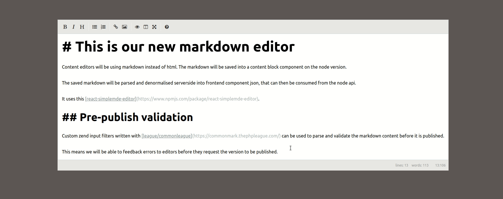

# Markdown Editor

Editor takes markdown as input, parses to HTML and renders live preview.

Proof of concept to replace wysiwyg editor using [react-simplemde-editor](https://www.npmjs.com/package/react-simplemde-editor).

Clone and use `npm start` to run.